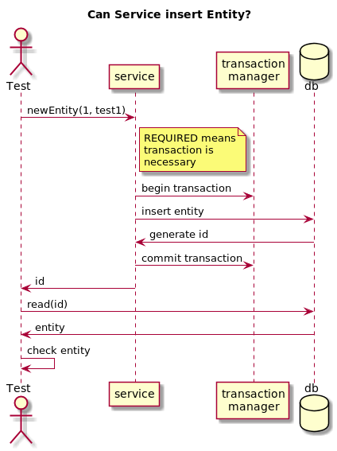
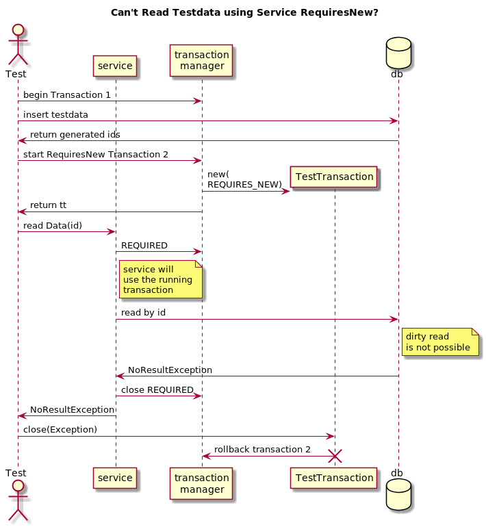
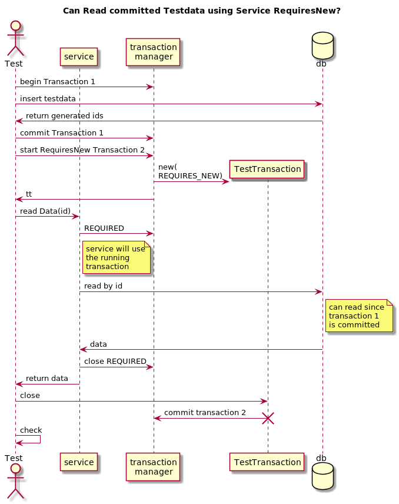

# One Service and One Entity

This example contains a Service implemented as stateless EJB which can return a constant number and offers the possibility to
add an Entity to a database and to search for it by its id.

[code](https://github.com/1and1/ejb-cdi-unit/tree/master/ejb-cdi-unit-examples/ex1-1entity)

To enable testing the [Test-Class](https://github.com/1and1/ejb-cdi-unit/blob/master/ejb-cdi-unit-examples/ex1-1entity/src/test/java/com/oneandone/ejbcdiunit/test/ServiceTest.java) must be shaped as following:

        @RunWith(EjbUnitRunner.class)
        @AdditionalClasses({Service.class, TestPersistenceFactory.class})
        public class ServiceTest {
            @Inject
            ServiceIntf sut;

            @Inject
            EntityManager entityManager;

* EjbUnitRunner is an adapted CdiRunner which makes sure that the EjbExtensions are activated during the CDI-Initialization.
* AdditionalClasses builds up the Test-Container.
    * Service defines a minimal Deployable containing the class to be tested and it's dependent classes.
    * TestPersistenceFactory defines an object which is able to produce EntityManagers for the PersistenceUnit with name "test".
* EntityManager is injected to allow access to the DBMS to be able to verify that the intended changes are there.
* In the Test-Class there are further injections necessary for specific kinds of tests which will be shown during the description of the testing functions.

To allow access to the database the resources/META-INF contains a file [persistence.xml](https://github.com/1and1/ejb-cdi-unit/blob/master/ejb-cdi-unit-examples/ex1-service1entity/src/test/resources/META-INF/persistence.xml). The testing happens using H2 working in Postgres-compatible mode.
To allow hibernate to work with the Entity, this is added as class there.

The Testfunctions:

* *canServiceReturnFive* shows that Service can be called and returns a constant value.
* *canServiceInsertEntity1* shows that the Service can be called. After the call it is verified, that the Entity has actually been inserted into the database. Since the call was done without a running transaction, the attribute "REQUIRED" of newEntity1() made sure, that the entity is inserted into the database using one completed transaction. The test assures that by reading itself the object using the assumed id 1. You can safely assume this since H2 should be cleared after each test and reinitialized before.

* *canReadEntity1AfterInsertion* shows that the service is able to read data previously inserted using service methods. The testing works without transaction therefore each call is run in a separate completed transaction.
* *canReadTestDataUsingService* demonstrates how a test-function can prepare testdata. Since the function must change in the dbms, it becomes necessary to begin a transaction. To be able to do this Usertransaction can be injected and used. Since the Servicecalls are attributed by "REQUIRED", you have to be aware, that changes possibly are not saved yet. Since the data is only inserted and is so in reality because of the necessary determination of the id, the service-call really is able to find the required object.
* *cantReadTestDataUsingServiceInRequiredNew* demonstrates a potential pitfall. The transaction which created the testdata has not been committed yet. Using:  

         persistenceFactory.transaction(TransactionAttributeType.REQUIRES_NEW, new TestClosure() {
            @Override
            public void execute() throws Exception {
                sut.getStringValueFor(entities.get(5).getId());
            }
        });    
the call is done in a separate transaction which can't read the "yet dirty" data, inserted previously in the testcode. Therefore the service call which previously assumed that exactly one entity should be found for this id, creates a NoResultException. The Testclosure embeds this Exception in a TestTransactionException.

* *canReadCommittedTestDataUsingServiceInRequiredNew* see first the explanation of cantReadTestDataUsingServiceInRequiredNew. Since the transaction creating the testdata has been committed, the embedded transaction is able to read and the NoResultException does not occur.

